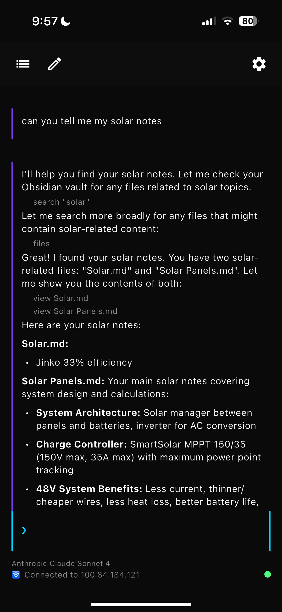
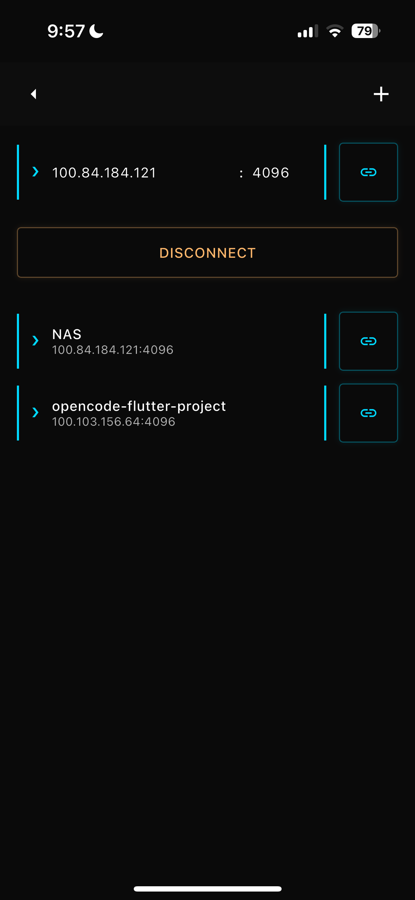
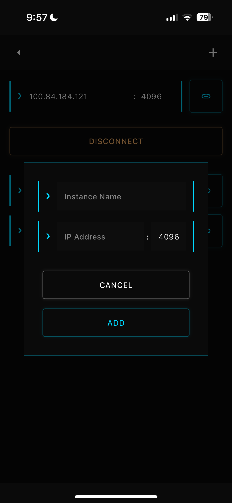
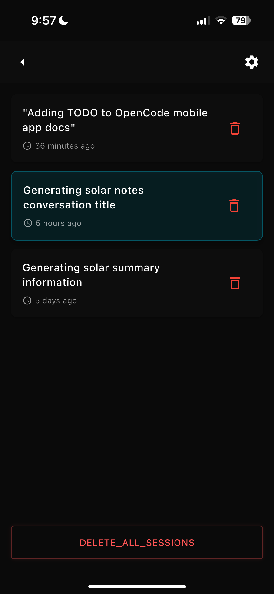

# OpenCode Flutter Client

An **unofficial** Flutter mobile client for [OpenCode](https://opencode.ai) - an AI-powered coding assistant that runs locally on your machine.

> **Note**: This is a third-party client developed independently and is not officially affiliated with or endorsed by the OpenCode team.

## Features

- 🤖 **AI-Powered Coding Assistant**: Connect to your local OpenCode server for intelligent code assistance
- 💬 **Real-time Chat Interface**: Interactive chat with streaming responses
- 🔧 **Multiple AI Providers**: Support for various AI models and providers
- 📱 **Cross-Platform**: Runs on iOS, Android, macOS, Windows, and Linux
- 🔒 **Privacy-First**: All processing happens locally on your machine
- 🎨 **Syntax Highlighting**: Code blocks with proper syntax highlighting
- 📝 **Markdown Support**: Rich text rendering for AI responses
- 🔄 **Session Management**: Save and restore conversation sessions
- 🌐 **Network Monitoring**: Automatic connection status tracking

## Screenshots

<div align="center">
  
  
  
  
</div>

## Prerequisites

- **Flutter SDK**: Version 3.5.4 or higher
- **OpenCode Server**: Running locally on your machine
  - Download from [opencode.ai](https://opencode.ai)
  - Or install via npm: `npm install -g @opencode/cli`

## Installation

### Option 1: Clone and Build

1. **Clone the repository**:
   ```bash
   git clone https://github.com/mikaelwills/opencode-flutter-client.git
   cd opencode-flutter-client
   ```

2. **Install dependencies**:
   ```bash
   flutter pub get
   ```

3. **Run the app**:
   ```bash
   flutter run
   ```

### Option 2: Download Release

Download the latest release for your platform from the [Releases](https://github.com/mikaelwills/opencode-flutter-client/releases) page.

## Configuration

### First Launch Setup

1. **Start OpenCode Server**: Ensure your OpenCode server is running locally
2. **Configure Connection**: 
   - Open the app settings
   - Enter your server IP address (default: localhost)
   - Set the port (default: 4096)
3. **Select Provider**: Choose your preferred AI provider from the settings
4. **Start Chatting**: Begin your coding session!

### Server Configuration

The app connects to your local OpenCode server. Make sure:
- OpenCode server is running on your machine
- The server is accessible on the configured IP/port
- Your firewall allows connections to the OpenCode port

## Usage

### Basic Chat
1. Type your coding question or request in the input field
2. Press send or hit Enter
3. Watch as the AI streams its response in real-time
4. Code blocks are automatically syntax-highlighted

### Session Management
- **Save Sessions**: Your conversations are automatically saved
- **Load Previous Sessions**: Access past conversations from the sessions screen
- **Multiple Sessions**: Work on different projects simultaneously

### Provider Management
- Switch between different AI providers
- Configure provider-specific settings
- Monitor provider status and performance

## Architecture

This Flutter app uses:
- **BLoC Pattern**: For state management and business logic
- **Go Router**: For declarative navigation
- **HTTP + SSE**: For real-time communication with OpenCode server
- **Provider Pattern**: For dependency injection
- **Shared Preferences**: For persistent settings storage

### Key Components

- `lib/blocs/`: BLoC state management
- `lib/services/`: Network and API services
- `lib/screens/`: UI screens and pages
- `lib/widgets/`: Reusable UI components
- `lib/models/`: Data models and DTOs

## Development

### Prerequisites
- Flutter SDK 3.5.4+
- Dart SDK (included with Flutter)
- IDE with Flutter support (VS Code, Android Studio, IntelliJ)

### Setup
```bash
# Clone the repo
git clone https://github.com/mikaelwills/opencode-flutter-client.git
cd opencode-flutter-client

# Install dependencies
flutter pub get

# Run code analysis
flutter analyze

# Run tests
flutter test

# Run the app
flutter run
```

### Building for Release

```bash
# Android
flutter build apk --release
flutter build appbundle --release

# iOS
flutter build ios --release

# macOS
flutter build macos --release

# Windows
flutter build windows --release

# Linux
flutter build linux --release
```

## Contributing

We welcome contributions! Please see our [Contributing Guidelines](CONTRIBUTING.md) for details.

### Quick Start for Contributors

1. Fork the repository
2. Create a feature branch: `git checkout -b feature/amazing-feature`
3. Make your changes and test thoroughly
4. Run `flutter analyze` to ensure code quality
5. Commit your changes: `git commit -m 'Add amazing feature'`
6. Push to your branch: `git push origin feature/amazing-feature`
7. Open a Pull Request

## Troubleshooting

### Common Issues

**Connection Failed**
- Ensure OpenCode server is running
- Check IP address and port configuration
- Verify firewall settings

**App Crashes on Startup**
- Clear app data and restart
- Check Flutter and Dart SDK versions
- Review device logs for specific errors

**Slow Performance**
- Check network connection to server
- Monitor device memory usage
- Consider reducing message history

### Getting Help

- 📖 [Documentation](https://opencode.ai/docs)
- 🐛 [Report Issues](https://github.com/mikaelwills/opencode-flutter-client/issues)
- 💬 [Community Discussions](https://github.com/mikaelwills/opencode-flutter-client/discussions)

## License

This project is licensed under the MIT License - see the [LICENSE](LICENSE) file for details.

## Acknowledgments

- Built with [Flutter](https://flutter.dev)
- Powered by [OpenCode](https://opencode.ai)
- Icons from [Cupertino Icons](https://pub.dev/packages/cupertino_icons)
- Syntax highlighting by [Flutter Highlight](https://pub.dev/packages/flutter_highlight)

---

<div align="center">
  <strong>Made with ❤️ for the coding community</strong>
</div>
